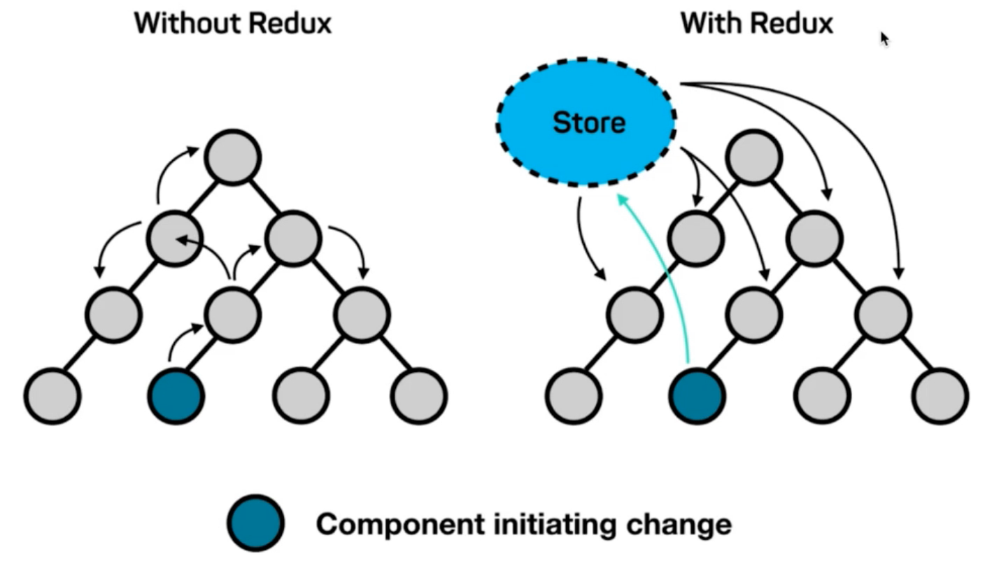
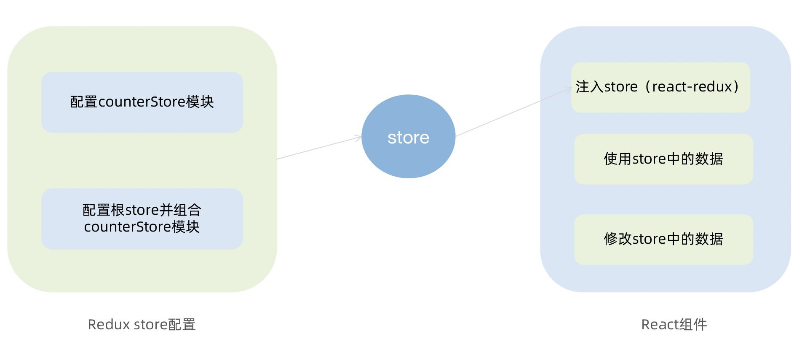
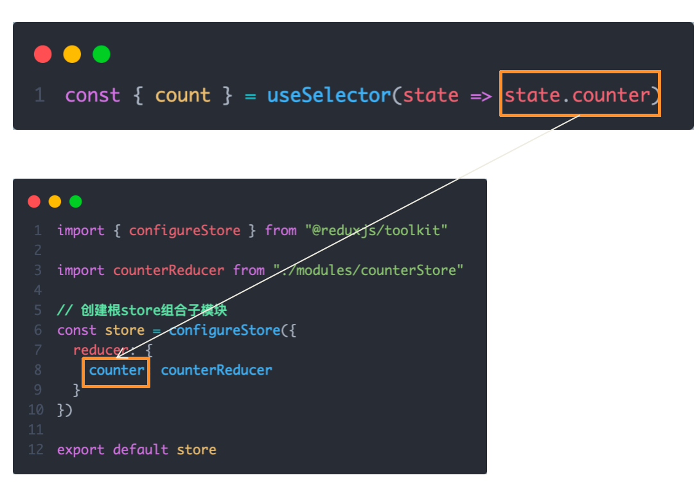
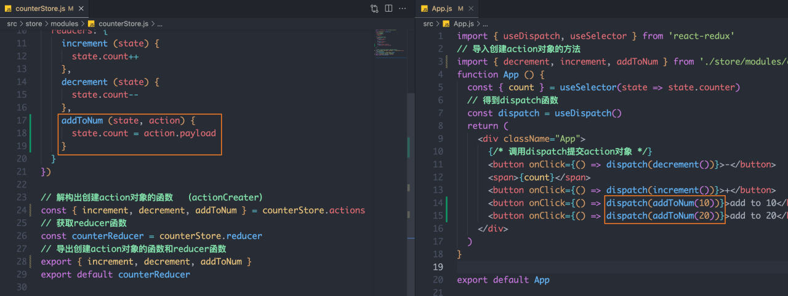
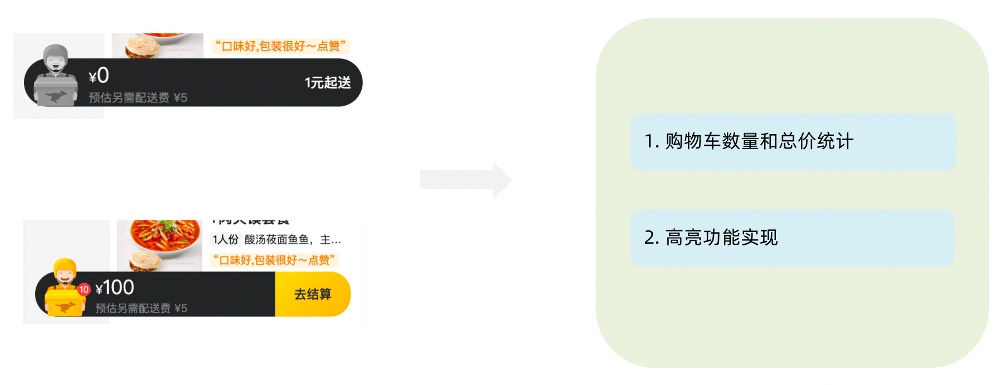
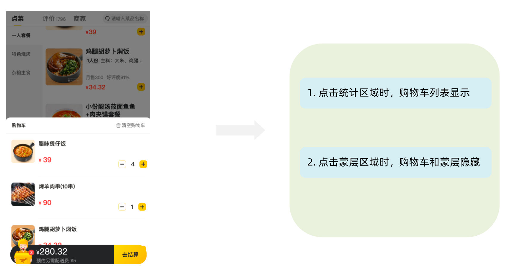

### 什么是Redux
Redux 是React最常用的集中状态管理工具，类似于Vue中的Pinia(Vuex),可以独立于框架运行
作用：通过集中管理的方式管理应用状态


### Redux快速体验
不和任何框架绑定，不使用任何构建工具，使用纯Redux实现计数器


使用步骤：
1. 定义一个reducer 函数（根据当前想要做的修改返回一个新的状态）
2. 使用createStore 方法传入 reducer函数 生成一个store实例对象
3. 使用store示例的subscribe方法订阅数据的变化（数据一旦变化，可以得到通知）
4. 使用store示例的dispatch方法提交action对象 触发数据变化（告诉reducer你想怎么修改数据）
5. 使用store示例的getState方法获取最新的状态数据更新到试图中

代码：
```javascript 
   <button id="decrement">-</button>
<span id="count">0</span>
<button id="increment">+</button>

<script src="https://unpkg.com/redux@latest/dist/redux.min.js"></script>

<script>
  // 定义reducer函数 
  // 内部主要的工作是根据不同的action 返回不同的state
  function counterReducer (state = { count: 0 }, action) {
    switch (action.type) {
      case 'INCREMENT':
        return { count: state.count + 1 }
      case 'DECREMENT':
        return { count: state.count - 1 }
      default:
        return state
    }
  }
  // 使用reducer函数生成store实例
  const store = Redux.createStore(counterReducer)

  // 订阅数据变化
  store.subscribe(() => {
    console.log(store.getState())
    document.getElementById('count').innerText = store.getState().count

  })
  // 增
  const inBtn = document.getElementById('increment')
  inBtn.addEventListener('click', () => {
    store.dispatch({
      type: 'INCREMENT'
    })
  })
  // 减
  const dBtn = document.getElementById('decrement')
  dBtn.addEventListener('click', () => {
    store.dispatch({
      type: 'DECREMENT'
    })
  })
</script> 
```
### Redux数据流架构
> Redux的难点是理解它对于数据修改的规则, 下图动态展示了在整个数据的修改中，数据的流向


为了职责清晰，Redux代码被分为三个核心的概念

1. state：一个对象 存放着我们管理的数据
2. action：一个对象 用来描述你想怎么该数据
3. reducer：一个函数 根据action的描述更新 State

### Redux与React - 环境准备

> Redux虽然是一个框架无关可以独立运行的插件，但是社区通常还是把它与React绑定在一起使用，以一个计数器案例体验一下Redux + React 的基础使用

#### 配套工具
> 在React中使用redux，官方要求安装俩个其他插件 - Redux Toolkit 和 react-redux

1. Redux Toolkit（RTK）- 官方推荐编写Redux逻辑的方式，是一套工具的集合集，简化书写方式
2. react-redux - 用来 链接 Redux 和 React组件 的中间件


#### 配置基础环境
1. 使用 CRA 快速创建 React 项目

```cmd
    npx create-react-app react-redux 
```

2. 安装配套工具

```cmd
npm i @reduxjs/toolkit  react-redux 
```

3. 启动项目

```cmd
    npm run start 
 ```

#### store目录结构设计


1. 通常集中状态管理的部分都会单独创建一个单独的 `store` 目录
2. 应用通常会有很多个子store模块，所以创建一个 `modules` 目录，在内部编写业务分类的子store
3. store中的入口文件 index.js 的作用是组合modules中所有的子模块，并导出store

### Redux与React - 实现counter
1. 整体路径熟悉
  

2. 使用React Toolkit 创建 counterStore

```js
import { createSlice } from '@reduxjs/toolkit'

const counterStore = createSlice({
    // 模块名称独一无二
    name: 'counter',
    // 初始状态
    initialState: {
        count: 1
    },
    // 修改数据的同步方法
    reducers: {
        increment(state) {
            state.count++
        },
        decrement(state) {
            state.count--
        }
    }
})
// 解构出actionCreater
const { increment, decrement } = counterStore.actions
// 获取reducer函数
const counterReducer = counterStore.reducer

// 导出
export { increment, decrement }
export default counterReducer
```

```js
    import { configureStore } from "@reduxjs/toolkit";
// 导入子模块 reducer
import counterReducer from "./modules/counterStore";

const store = configureStore({
    reducer: {
        // 注册子模块
        counter: counterReducer
    }
})

export default store
```

3. 为React注入store

> react-redux负责把Redux和React 链接 起来，内置 Provider组件 通过 store 参数把创建好的store实例注入到应用中，链接正式建立


```javascript
import React from 'react';
import ReactDOM from 'react-dom/client';
import './index.css';
import App from './App';
import reportWebVitals from './reportWebVitals';
import store from './store'
import { Provider } from 'react-redux'

const root = ReactDOM.createRoot(document.getElementById('root'));
root.render(
  <React.StrictMode>
    <Provider store={store}>
      <App />
    </Provider>
  </React.StrictMode>
);

// If you want to start measuring performance in your app, pass a function
// to log results (for example: reportWebVitals(console.log))
// or send to an analytics endpoint. Learn more: https://bit.ly/CRA-vitals
reportWebVitals();
```

4. React组件使用store中的数据
> 在React组件中使用store中的数据，需要用到一个钩子函数 - useSelector，它的作用是把store中的数据映射到组件中，使用样例如下：

  

5. React 组件修改store中的数据
> React组件中修改store中的数据需要借助另外一个hook函数 - useDispatch，它的作用是生成提交action对象的dispatch函数，使用样例如下：


  

#### Redux和React - 提交action传参

> 需求：组件中有俩个按钮 `add to 10` 和 `add to 20` 可以直接把count值修改到对应的数字，目标count值是在组件中传递过去的，需要在提交action的时候传递参数

  

实现方式：在reducers的同步修改方法中添加action对象参数，在调用actionCreater的时候传递参数，参数会被传递到action对象payload属性上

 

#### Redux与React - 异步action处理

 

实现步骤
1. 创建store的写法保持不变，配置好同步修改状态的方法
2. 单独封装一个函数，再函数内部return一个新函数，在新函数中
   2.1. 封装异步请求获取数据
   2.2. 调用同步actionCreater传入异步数据生成一个action对象，并使用dispatch提交
3. 组件中dispatch的写法保持不变

#### Redux调试-devtools

>Redux官方提供了针对于Redux的调试工具，支持实时state信息展示，action提交信息查看等
 

#### 美团小案例
1. 案例演示
 

>基本开发思路：使用 RTK（Redux Toolkit）来管理应用状态, 组件负责 数据渲染 和 dispatch action

2. 准备并熟悉环境

```cmd
git clone http://git.itcast.cn/heimaqianduan/redux-meituan.git 
```

3. 分类和商品列表渲染


- 编写store逻辑

```js
// 编写store
import { createSlice } from "@reduxjs/toolkit"
import axios from "axios"

const foodsStore = createSlice({
  name: 'foods',
  initialState: {
    // 商品列表
    foodsList: []
  },
  reducers: {
    // 更改商品列表
    setFoodsList (state, action) {
      state.foodsList = action.payload
    }
  }
})

// 异步获取部分
const { setFoodsList } = foodsStore.actions
const fetchFoodsList = () => {
  return async (dispatch) => {
    // 编写异步逻辑
    const res = await axios.get('http://localhost:3004/takeaway')
    // 调用dispatch函数提交action
    dispatch(setFoodsList(res.data))
  }
}

export { fetchFoodsList }

const reducer = foodsStore.reducer

export default reducer
```

- 组件使用store数据
```js
// 省略部分代码
import { useDispatch, useSelector } from 'react-redux'
import { fetchFoodsList } from './store/modules/takeaway'
import { useEffect } from 'react'

const App = () => {
  // 触发action执行
  // 1. useDispatch -> dispatch 2. actionCreater导入进来 3.useEffect
  const dispatch = useDispatch()
  useEffect(() => {
    dispatch(fetchFoodsList())
  }, [dispatch])

  return (
    <div className="home">
      {/* 导航 */}
      <NavBar />

      {/* 内容 */}
      <div className="content-wrap">
        <div className="content">
          <Menu />
          <div className="list-content">
            <div className="goods-list">
              {/* 外卖商品列表 */}
              {foodsList.map(item => {
                return (
                  <FoodsCategory
                    key={item.tag}
                    // 列表标题
                    name={item.name}
                    // 列表商品
                    foods={item.foods}
                  />
                )
              })}
            </div>
          </div>
        </div>
      </div>
      {/* 购物车 */}
      <Cart />
    </div>
  )
}

export default App
```

#### 点击分类激活交互实现
  


- 编写store逻辑
```js
// 编写store

import { createSlice } from "@reduxjs/toolkit"
import axios from "axios"

const foodsStore = createSlice({
  name: 'foods',
  initialState: {
    // 菜单激活下标值
    activeIndex: 0
  },
  reducers: {
    // 更改activeIndex
    changeActiveIndex (state, action) {
      state.activeIndex = action.payload
    }
  }
})

// 导出
const { changeActiveIndex } = foodsStore.actions

export { changeActiveIndex }

const reducer = foodsStore.reducer

export default reducer
```

- 编写组件逻辑

```js
const Menu = () => {
  const { foodsList, activeIndex } = useSelector(state => state.foods)
  const dispatch = useDispatch()
  const menus = foodsList.map(item => ({ tag: item.tag, name: item.name }))
  return (
    <nav className="list-menu">
      {/* 添加active类名会变成激活状态 */}
      {menus.map((item, index) => {
      return (
        <div
          // 提交action切换激活index
          onClick={() => dispatch(changeActiveIndex(index))}
          key={item.tag}
          // 动态控制active显示
          className={classNames(
            'list-menu-item',
            activeIndex === index && 'active'
          )}
          >
          {item.name}
        </div>
      )
    })}
    </nav>
  )
}
```

#### 商品列表切换显示


```js

<div className="list-content">
  <div className="goods-list">
    {/* 外卖商品列表 */}
    {foodsList.map((item, index) => {
      return (
        activeIndex === index && <FoodsCategory
          key={item.tag}
          // 列表标题
          name={item.name}
          // 列表商品
          foods={item.foods}
        />
      )
    })}
  </div>
</div>

```

#### 添加购物车实现


- 编写store逻辑

```js
// 编写store

import { createSlice } from "@reduxjs/toolkit"
import axios from "axios"

const foodsStore = createSlice({
  name: 'foods',
  reducers: {
    // 添加购物车
    addCart (state, action) {
      // 是否添加过？以action.payload.id去cartList中匹配 匹配到了 添加过
      const item = state.cartList.find(item => item.id === action.payload.id)
      if (item) {
        item.count++
      } else {
        state.cartList.push(action.payload)
      }
    }
  }
})

// 导出actionCreater
const { addCart } = foodsStore.actions

export { addCart }

const reducer = foodsStore.reducer

export default reducer
```
- 编写组件逻辑
```js
<div className="goods-count">
  {/* 添加商品 */}
  <span 
    className="plus" 
    onClick={() => dispatch(addCart({
    id,
    picture,
    name,
    unit,
    description,
    food_tag_list,
    month_saled,
    like_ratio_desc,
    price,
    tag,
    count
  }))}></span>
</div>
```
#### 统计区域实现



实现思路：
- 基于store中的cartList的length渲染数量
- 基于store中的cartList累加price * count
- 购物车cartList的length不为零则高亮

```js
// 计算总价 
const totalPrice = cartList.reduce((a, c) => a + c.price * c.count, 0)

{/* fill 添加fill类名购物车高亮*/}
{/* 购物车数量 */}
<div onClick={onShow} className={classNames('icon', cartList.length > 0 && 'fill')}>
  {cartList.length > 0 && <div className="cartCornerMark">{cartList.length}</div>}
</div>
```

#### 购物车列表功能实现


- 控制列表渲染
  
```js
const Cart = () => {
  return (
    <div className="cartContainer">
      {/* 添加visible类名 div会显示出来 */}
      <div className={classNames('cartPanel', 'visible')}>
        {/* 购物车列表 */}
        <div className="scrollArea">
          {cartList.map(item => {
            return (
              <div className="cartItem" key={item.id}>
                
                <div className="main">
                  <div className="skuInfo">
                    <div className="name">{item.name}</div>
                  </div>
                  <div className="payableAmount">
                    <span className="yuan">¥</span>
                    <span className="price">{item.price}</span>
                  </div>
                </div>
                <div className="skuBtnWrapper btnGroup">
                  {/* 数量组件 */}
                  <Count
                    count={item.count}
                  />
                </div>
              </div>
            )
          })}
        </div>
      </div>
    </div>
  )
}

export default Cart
```

- 购物车增减逻辑实现

```js
// count增
increCount (state, action) {
  // 关键点：找到当前要修改谁的count id
  const item = state.cartList.find(item => item.id === action.payload.id)
  item.count++
},
// count减
decreCount (state, action) {
  // 关键点：找到当前要修改谁的count id
  const item = state.cartList.find(item => item.id === action.payload.id)
  if (item.count === 0) {
    return
  }
  item.count--
}
```
```js
<div className="skuBtnWrapper btnGroup">
  {/* 数量组件 */}
  <Count
    count={item.count}
    onPlus={() => dispatch(increCount({ id: item.id }))}
    onMinus={() => dispatch(decreCount({ id: item.id }))}
    />
</div>
```

- 清空购物车
```js
// 清除购物车
clearCart (state) {
  state.cartList = []
}
```
```js
<div className="header">
  <span className="text">购物车</span>
  <span 
    className="clearCart" 
    onClick={() => dispatch(clearCart())}>
    清空购物车
  </span>
</div>
```
- 控制购物车显示和隐藏


```js
// 控制购物车打开关闭的状态
const [visible, setVisible] = useState(false)

const onShow = () => {
  if (cartList.length > 0) {
    setVisible(true)
  }
}


{/* 遮罩层 添加visible类名可以显示出来 */}
<div
    className={
     classNames('cartOverlay', visible && 'visible')
  }
    onClick={() => setVisible(false)}
/>
```

